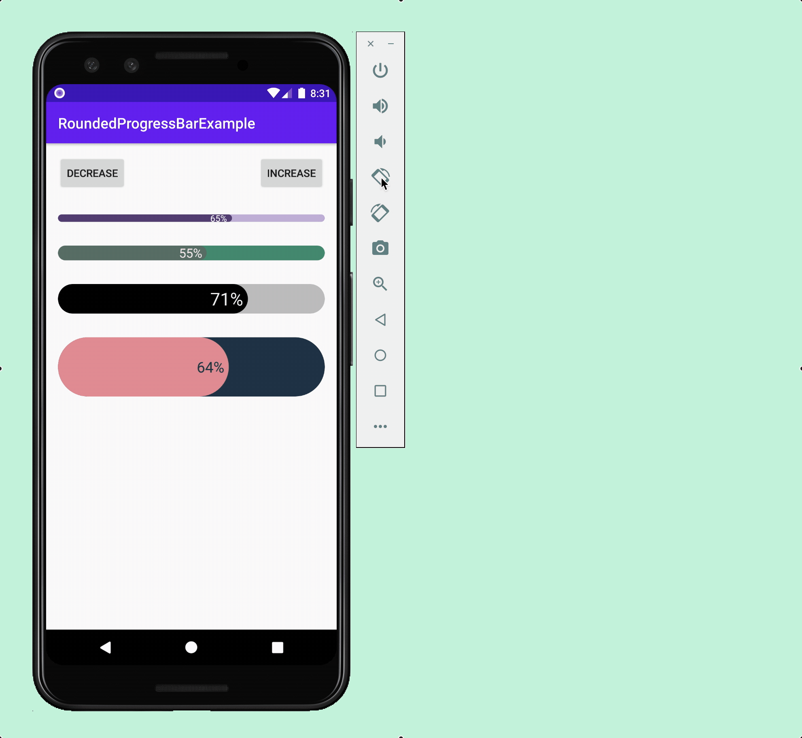

<p align="center">
    
</p>
<h1 align="center">RoundedProgressBar</h1>
<p align="center">Easy, Beautiful, Customizable</p>

<p align="center">
    <a href="https://developer.android.com/"></a>
    <a href="https://android-arsenal.com/api?level=21"></a>
    <a href="https://github.com/MackHartley/RoundedProgressBar/actions/workflows/buildAndTest.yml"></a>
    <a href="https://github.com/MackHartley/RoundedProgressBar/graphs/commit-activity"></a>
</p>

The `RoundedProgressBar` library gives you a highly customizable and easy to use progress bar. One of the defining features of this library is that you can create progress bars with rounded corners. However, this library comes with many other useful features and customization options! Below are several examples of progress bars created with this library.
<br>
<br>
<p align="center">
    
    <br>
</p>

If you’d like to see if this library is right for your project then try downloading the demo app which is available on the Google Play Store. There you can fully customize a `RoundedProgressBar` to see if you’re able to achieve the desired look and feel for your project.
<br>
<br>
<p align="center">
    
    <br>
    <i>The demo app is also included in this repository under the 'app' directory</i>
</p>

# Gradle Setup ⚙️
[](https://jitpack.io/#MackHartley/RoundedProgressBar)

If you don't have this already, add it to your **root** build.gradle file:
```
allprojects {
    repositories {
        ...
        maven { url 'https://jitpack.io' }
    }
}
```

Then you can add the dependency to your **app** build.gradle file:
```
dependencies {
    ...
    implementation 'com.github.MackHartley:RoundedProgressBar:1.0.1'
}
```

# Notable Features 🌟

1) **Animation** - Both the progress bar and progress text animate
2) **Full Color Customization** - You can even specify what color the text is depending on which background it draws over
<p align="center">
    
</p>

3) **Low Value Support** - The progress bar looks nice even at low values (This is a common issue when dealing with rounded progress bars)
<p align="center">
    
</p>

4) **Any Corner Radius Allowed** - Individual corners can even have different radius values
<p align="center">
    
</p>

5) **Modular** - The `RoundedProgressBar` library can be seamlessly included in custom layouts due to it's customizability and the fact that each corner can have a different radius
<p align="center">
    
</p>
    
**Additionally**, the `RoundedProgressBar` handles all state on configuration changes including situations where there are multiple progress bars:
<p align="center">
    
</p>

# Public Methods and Xml Attributes ⌨️
These are the methods which can be called on the `RoundedProgressBar` class:

```
setProgressPercentage(progressPercentage: Double, shouldAnimate: Boolean = true)
getProgressPercentage(): Double

setProgressDrawableColor(@ColorInt newColor: Int) // Sets the color of the 'progress' part of the progress bar
setBackgroundDrawableColor(@ColorInt newColor: Int) // Sets the color of the 'background' part of the progress bar
setProgressTextColor(@ColorInt newColor: Int) // Sets text color for when it is drawn over the progress part of progress bar
setBackgroundTextColor(@ColorInt newColor: Int) // Sets text color for when it is drawn over the background part of progress bar

setCornerRadius(
    topLeftRadius: Float,
    topRightRadius: Float,
    bottomRightRadius: Float,
    bottomLeftRadius: Float
)

setTextSize(newTextSize: Float)
setTextPadding(newTextPadding: Float) // Sets the padding between the progress text and end (or start) of the progress bar
setAnimationLength(newAnimationLength: Long)

showProgressText(shouldShowProgressText: Boolean)
setRadiusRestricted(isRestricted: Boolean)
setOnlyShowTrue0(shouldOnlyShowTrue0: Boolean) // If true the progress bar will not allow non zero values to round down to "0%"
setOnlyShowTrue100(shouldOnlyShowTrue100: Boolean) // If true the progress bar will not allow non '100' values to round up to "100%"
```

The `RoundedProgressBar` can also be configured via xml attributes. Below is the full list of attributes along with the methods they map to.
| Method | Xml Attribute |
|---|---|
| `rpbProgress` | `setProgressPercentage(...)` |
| `rpbProgressColor` | `setProgressDrawableColor(...)` |
| `rpbBackgroundColor` | `setBackgroundDrawableColor(...)` |
| `rpbProgressTextColor` | `setProgressTextColor(...)` |
| `rpbBackgroundTextColor` | `setBackgroundTextColor(...)` |
| `rpbCornerRadius` | `setCornerRadius(...)` |
| `rpbCornerRadiusTopLeft` | `setCornerRadius(...)` |
| `rpbCornerRadiusTopRight` | `setCornerRadius(...)` |
| `rpbCornerRadiusBottomRight` | `setCornerRadius(...)` |
| `rpbCornerRadiusBottomLeft` | `setCornerRadius(...)` |
| `rpbTextSize` | `setTextSize(...)` |
| `rpbTextPadding` | `setTextPadding(...)` |
| `rpbAnimationLength` | `setAnimationLength(...)` |
| `rpbShowProgressText` | `showProgressText(...)` |
| `rpbIsRadiusRestricted` | `setRadiusRestricted(...)` |
| `rpbOnlyShowTrue0` | `setOnlyShowTrue0(...)` |
| `rpbOnlyShowTrue100` | `setOnlyShowTrue100(...)` |

# Contributing 🤝
Feel free to open up issues on this repo to report bugs or request features. 

Additionally if you'd like to contribute to the library please feel free to open up a pull request! Just give me a heads up first though (via issues or comments) so we don't overwrite each other in the event I am updating the project.

Special thanks to all those who have supported this repo thus far!
<p align="center">
    <br>
    <a href="https://github.com/MackHartley/RoundedProgressBar/stargazers"></a>
    <br>
    <a href="https://github.com/MackHartley/RoundedProgressBar/network/members"></a>
</p>

# License 📄
```
Copyright 2021 Mack Hartley

Licensed under the Apache License, Version 2.0 (the "License");
you may not use this file except in compliance with the License.
You may obtain a copy of the License at

   http://www.apache.org/licenses/LICENSE-2.0

Unless required by applicable law or agreed to in writing, software
distributed under the License is distributed on an "AS IS" BASIS,
WITHOUT WARRANTIES OR CONDITIONS OF ANY KIND, either express or implied.
See the License for the specific language governing permissions and
limitations under the License.
```
