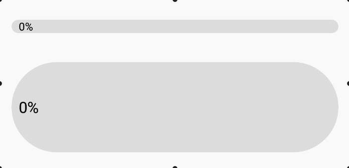

<p align="center">
    
</p>
<h1 align="center">RoundedProgressBar</h1>
<p align="center">Easy, Beautiful, Customizeable</p>

<p align="center">
    <a href="https://developer.android.com/"></a>
    <a href="https://android-arsenal.com/api?level=21"></a>
    <a href="https://github.com/MackHartley/RoundedProgressBar/issues"></a>
    <a href="https://github.com/MackHartley/RoundedProgressBar/graphs/commit-activity"></a>
</p>

Using the `RoundedProgressBar` library you have a wide range of customizable options for making progress bars that have rounded edges. Below I've made a gif highlighting just a few examples of different looking progress bars created with this library:

<p align="center">
    
    <br>
    <i>This demo app is included in this repository under the app directory</i>
</p>

# Gradle Setup ⚙️
[](https://jitpack.io/#MackHartley/RoundedProgressBar)

If you don't have this already, add it to your **root** build.gradle file:
```
allprojects {
    repositories {
        ...
        maven { url 'https://jitpack.io' }
    }
}
```

Then you can add the dependency to your **app** build.gradle file:
```
dependencies {
    ...
    implementation 'com.github.MackHartley:RoundedProgressBar:1.0.1'
}
```

# Features 🌟

1) **Percentage complete text**  displayed on right side of progress bar
2) **Animaition**  of Progress bar and progress text

<p align="center">
    
</p>

3) **Foreground and background colors**  can be set
4) **Different text colors**  can be set for progress text depending on which background it's on top of
5) **Looks nice at low values**  (an occasional issue with rounded progress bar solutions)

<p align="center">
    
</p>

6) **Any height and width**  can be used

<p align="center">
    
</p>

**Additionally**, the `RoundedProgressBar` handles all state on config changes including situations where there are multiple progress bars:

<p align="center">
    
</p>

# Public Methods and Xml Attributes ⌨️
These are the methods which can be called on the RoundedProgressBar class:

```
setProgressPercentage(progressPercentage: Double, shouldAnimate: Boolean = true)
getProgressPercentage(): Double

setProgressColor(colorRes: Int) // Sets the color of the 'progress' part of the progress bar
setProgressBgColor(colorRes: Int) // Sets the color of the progress bar background

setTextColor(colorRes: Int) // Sets text color for when it is drawn over the progress part of progress bar
setBgTextColor(colorRes: Int) // Sets text color for when it is drawn over the progress bar background
setTextSize(sizeInPixels: Float)
showProgressText(shouldShowProgressText: Boolean) // Hide or show the progress text

setAnimationLength(newAnimationLength: Long)
```

Each setter is accessible via xml as well. Here I've mapped each setter to its corresponding xml attribute:
| Method | Xml Attribute |
|---|---|
| `setProgressPercentage(...)`  | `rpbProgress`  |
| `setProgressColor(...)`  | `rpbProgressColor`  |
| `setProgressBgColor(...)`  | `rpbProgressBgColor`  |
| `setTextSize(...)`  | `rpbTextSize`  |
| `setTextColor(...)`  | `rpbTextColor`  |
| `setBgTextColor(...)`  | `rpbBgTextColor`  |
| `showProgressText(...)`  | `rpbShowProgressText`  |
| `setAnimationLength(...)`  | `rpbAnimationLength`  |
<p align="center">
    <br>
    
    <br>
    <i>This diagram shows which methods are responsible for setting the different colors of the progress bar</i>
</p>

# Why I Made This 💭

A while back I was working on an Android app which relied heavily on having a few good looking progress bars. I found [this](https://github.com/akexorcist/RoundCornerProgressBar) library which was the best option in my opinion. However, as my project progressed I encountered the following issues with it:

- No ability to set text color depending on where it's drawn
- Occasional misplacement of text
- Looks strange at low values (Common issue with rounded progress bars)
- Doesn't have text animation

Unfortunately, these issues weren't acceptable for my use case, and that library was the best option I could find online. So not one to settle I decided to make something better suited for what I needed.

This is not to say that library is bad, it is quite good and has many more features than my library. However, my focus with this library was to make something simple that did a good job at just being a standard '0 - 100% style' progress bar.

# Contributing 🤝
Feel free to open up issues on this repo to report bugs or request features. Additionally if you'd like to contribute to the library feel free to open up a pull request. 

If you want to make a big change to the repo it's best to contact me first before you start so we can make sure your changes will be appropriate for this library.

# License 📄
```
Copyright 2020 Mack Hartley

Licensed under the Apache License, Version 2.0 (the "License");
you may not use this file except in compliance with the License.
You may obtain a copy of the License at

   http://www.apache.org/licenses/LICENSE-2.0

Unless required by applicable law or agreed to in writing, software
distributed under the License is distributed on an "AS IS" BASIS,
WITHOUT WARRANTIES OR CONDITIONS OF ANY KIND, either express or implied.
See the License for the specific language governing permissions and
limitations under the License.
```
